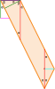

# vidavidorra logo

The vidavidorra logo, as shown in it's ASCII form below.

```
\\\\\\\\\\                                                        ..  //////
 \\      \\                                                      ..  //  //
  \\  ..  \\                                                    ..  //  //
   \\  ..  \\                                                  ..  //  //
    \\  ..  \\                                                ..  //  //
     \\  ..  \\                                              ..  //  //
      \\  ..  \\                                            ..  //  //
       \\  ..  \\                                          ..  //  //
        \\  ..  \\                                        ..  //  //
         \\  ..  \\                                      ..  //  //
          \\  ..  \\                                    ..  //  //
           \\  ..  \\                                  ..  //  //
            \\  ..  \\                                ..  //  //
             \\  ..  \\                              ..  //  //
              \\  ..  \\                            ..  //  //
               \\  ..  \\                          ..  //  //
                \\  ..  \\                        ..  //  //
                 \\  ..  \\                      ..  //  //
                  \\  ..  \\                    ..  //  //
                   \\  ..  \\                  ..  //  //
                    \\  ..  \\                ..  //  //
                     \\  ..  \\              ..  //  //
                      \\  ..  \\            ..  //  //
                       \\  ..  \\          ..  //  //
                        \\  ..  \\        ..  //  //
                         \\  ..  \\      ..  //  //
                          \\  ..  \\    ..  //  //
                           \\  ..  \/  ..  //  //
                            \\  ..    ..  //  //
                             \\  ..  ..  //  //
                              \\  ....  //  //
                               \\  ..  //  //
                                \\    //  //
                                 \\  //  //
                                  \\//  //
                                   \/  //
```

The following image shows a subsection, a "line", of logo including all angles used in the logo. The following list shows the definition and calculations of the elements of the "line" subsection. This is the definition that makes the logo.

- The green lines are the thickness of the line. This is the `thickness` variable in the code.
- $\alpha$ is the angle of the line in relation to a horizontal reference-line. This is therefore half the angle of the `V`. This is the `angle` variable in the code
- $\beta$ is the complementary angle of $\alpha$.
  $$\beta = 90° - \alpha$$
- The blue line is the length needed to intersect the line horizontally. This is the `horizontalSlice` variable in the code.
  $$horizontalSlice = \frac{\cos(\alpha)}{thickness}$$
- The red line is the length needed to intersect the line vertically. This is the `verticalSlice` variable in the code.
  $$verticalSlice = \frac{thickness}{\sin(\alpha)}$$
- The magenta line is the horizontal length needed to intersect the line **after** moving the thickness of the line vertically. This is the `horizontalDisplacement` variable in the code.
  $$horizontalDisplacement = \tan(\alpha) \times thickness$$
- The cyan line is the horizontal length needed to match match the end angle of the line from the red line, the vertical slice.
  $$\tan(\alpha) \times 0.5 \times verticalSlice$$
- The center of the `V`, i.e. it's point, is similar to the magenta line. Instead of moving the thickness of the line vertically, this is the effect of moving the height vertically. This is the `vCenter` variable in the code.
  $$vCenter = \tan(\alpha) \times height$$
- The height is the length from the top of the outer `V` to the bottom point of the outer `V`. This is the `height` variable in the code.
- The horizontal gap between the lines that make up the logo is the same as the thickness of the slice. Therefore, the horizontal gap between the lines is the same as the blue line and the vertical gap between the lines is the same as the red line.


